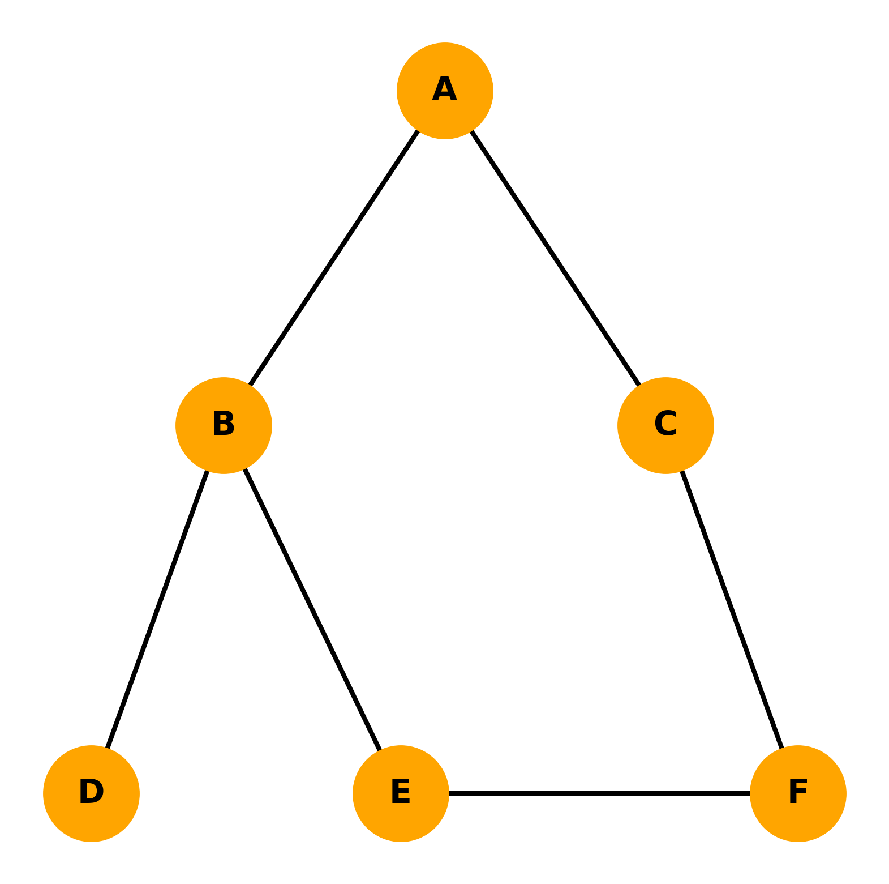

# 🚀 Path Planning: BFS Shortest Path Search



## 📌 Overview
This project demonstrates **Breadth-First Search (BFS)** for finding the shortest path in an unweighted graph.  
We model a simple map where a robot must travel from **A** to **F** through connected nodes, with each edge having the same cost.

---

## 🎯 Problem Statement
A robot starts at node **A** and needs to reach node **F**.  
All edges have equal weight (**1 hop**).  
The goal is to find the **shortest path (minimum number of hops)**.

---

## 🔍 Algorithm: Breadth-First Search
- **Idea:** Explore **level by level** — all neighbors first, then their neighbors.
- **Data Structure:** FIFO queue.
- **Guarantee:** In an unweighted graph, the first time you reach the goal, you’ve found the shortest path.
- **Complexity:**
  - **Time:** `O(V + E)` (visits each vertex and edge once)
  - **Space:** `O(V)` (stores visited nodes and parent mapping)
- **Pros:** Always finds shortest path.
- **Cons:** Can explore many unnecessary nodes if the graph is wide.

---

## 📜 BFS Implementation
```python
graph = {
    'A': ['B', 'C'],
    'B': ['A', 'D', 'E'],
    'C': ['A', 'F'],
    'D': ['B'],
    'E': ['B', 'F'],
    'F': ['C', 'E']
}

start = 'A'
goal = 'F'

queue = [start]
visited = set(start)
parent = {}

while queue:
    current = queue.pop(0)
    print(f"Visiting: {current}")
    for neighbor in graph[current]:
        if neighbor not in visited:
            queue.append(neighbor)
            visited.add(neighbor)
            parent[neighbor] = current

# Reconstruct shortest path
key = goal
path = []
while key in parent:
    key = parent[key]
    path.insert(0, key)
path.append(goal)

print("Path found:", path)
```


## 📊 BFS Execution Output & Explanation

```Python
Visiting: A
Neighbors: ['B', 'C']
Parent Mapping: {'B': 'A', 'C': 'A'}
Visited: {'B', 'A', 'C'}

Visiting: B
Neighbors: ['C', 'D', 'E']
Parent Mapping: {'B': 'A', 'C': 'A', 'D': 'B', 'E': 'B'}
Visited: {'E', 'D', 'B', 'A', 'C'}

Visiting: C
Neighbors: ['D', 'E', 'F']
Parent Mapping: {'B': 'A', 'C': 'A', 'D': 'B', 'E': 'B', 'F': 'C'}
Visited: {'E', 'D', 'F', 'B', 'A', 'C'}

Visiting: D
Neighbors: ['E', 'F']
Parent Mapping: {'B': 'A', 'C': 'A', 'D': 'B', 'E': 'B', 'F': 'C'}
Visited: {'E', 'D', 'F', 'B', 'A', 'C'}

Visiting: E
Neighbors: ['F']
Parent Mapping: {'B': 'A', 'C': 'A', 'D': 'B', 'E': 'B', 'F': 'C'}
Visited: {'E', 'D', 'F', 'B', 'A', 'C'}

Visiting: F
Neighbors: []
Parent Mapping: {'B': 'A', 'C': 'A', 'D': 'B', 'E': 'B', 'F': 'C'}
Visited: {'E', 'D', 'F', 'B', 'A', 'C'}

Path found: ['A', 'C', 'F']
```

### Step 1 — Start at A
- BFS starts at `A`.
- Adds `B` and `C` to the queue.
- Marks `B` and `C` as visited.
- Records that both `B` and `C` came from `A`.

---

### Step 2 — Visit B
- `C` is already visited, so it’s skipped.
- `D` and `E` are new, so they are added to the queue.
- Records that `D` and `E` came from `B`.

---
### Step 3 — Visit C
- `D` and `E` are already visited, so they’re skipped.
- `F` is new — **goal reached!**
- Records that `F` came from `C`.

---

### Step 4 — Remaining Visits
Even though `F` is found, BFS continues visiting remaining nodes in the queue for completeness:

---

### Path Reconstruction
Once BFS finishes, we backtrack from `F` using the **parent mapping**:
1. `F` → parent is `C`
2. `C` → parent is `A`
3. `A` has no parent (start node)

Final shortest path: A --> C --> F
